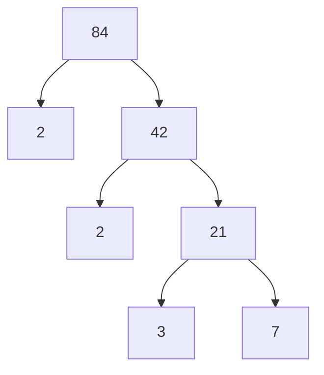

# Algebra Basics

## Uttryck (Expression)

- Innehåller tal, variabler och räknesätt.
- Får inte innehålla likhetstäcken!

## Ekvation (Equation)

- Likamedtecknet betyder att båda sidor är lika mycket värda.
- Man måste göra samma sak på båda sidor.
- Målet är ofta att hitta det okända talet (variabeln).

## Faktorisering

- Faktorisering betyder att skriva ett tal som en produkt av faktorer.
- Primfaktorisering betyder att skriva ett tal som en produkt av primtal.
- Exempel: $84 = 2 \cdot 2 \cdot 3 \cdot 7 = 2^2 \cdot 3 \cdot 7$.

