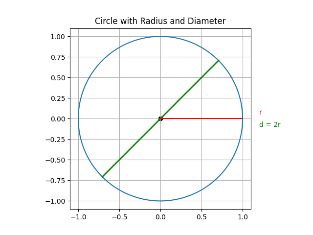

# Circle

- Radius = distance from the center (origin) to the circle (perimeter)
- Diameter = Radius \( \times 2 \)
- Circumference = distance around the circle
- \( \pi = \) circumference \( : \) diameter
- \( \pi ≈ \) 3.14159 (irrational number)

